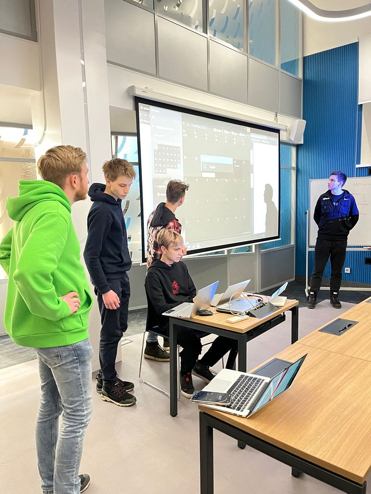

<strong>Notes with a Smart Task Ranking System (as part of the VK x IU5 Hackathon)</strong>

<em>December 2022</em>

<em>Django, Scikit-learn, Go, PostgreSQL, React</em>

A ToDo application for education that prioritizes tasks based on deadlines and personal preferences.

